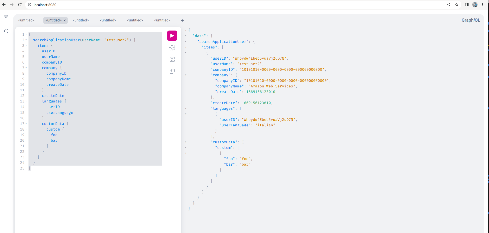
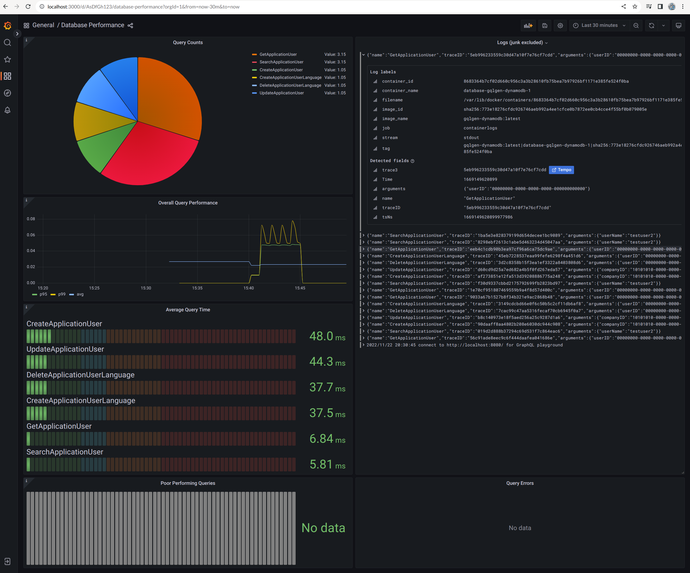
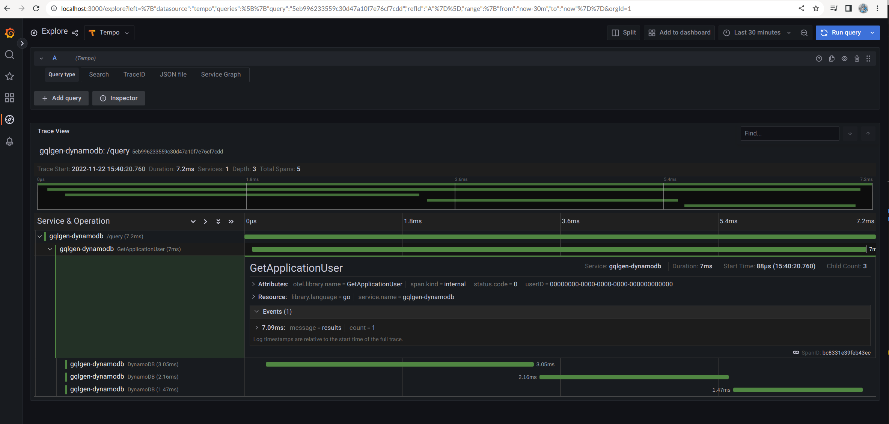

# GraphQL - gqlgen - DynamoDB

## Goal

The goal of this repo is show how to build a GraphQL API using gqlgen and DynamoDB. I've run a system like this one in production for a while and it's been working great. It is quick to extend and easy to maintain. It also is extendable via custom code directives which I have provided examples for.

Please read my blog post on this topic: [GraphQL - gqlgen - DynamoDB](https://www.craftycoder.io/blog/graphql-gqlgen-dynamodb/)

## Glossary

[GraphQL](https://graphql.org/)
> GraphQL is a query language for APIs and a runtime for fulfilling those queries with your existing data. GraphQL provides a complete and understandable description of the data in your API, gives clients the power to ask for exactly what they need and nothing more, makes it easier to evolve APIs over time, and enables powerful developer tools.

[gqlgen](https://github.com/99designs/gqlgen)
> gqlgem is a Go library for building GraphQL servers. It is based on a schema first approach, it prioritizes Type safety, and enables code generation.

[DynamoDB](https://aws.amazon.com/dynamodb/)

> Amazon DynamoDB is a fully managed, serverless, key-value NoSQL database designed to run high-performance applications at any scale. DynamoDB offers built-in security, continuous backups, automated multi-Region replication, in-memory caching, and data import and export tools.

## Challenges

GraphQL APIs are a great way to interface with your data, either between services or between client and server. DynamoDB is a great tool, but it is relatively difficult to work with. The challenge with DynamoDB is the learning curve and the annoyingly large quantity of boilderplate code required. What attracts me to DynamoDB is the low quantity of ongoing maintenance required. I don't have to worry about scaling, backups, or replication. I can just focus on building my application. The fact that gqlgen is designed for code generation, and that DynamoDB requires a lot of boilerplate code, makes it a perfect match.

## Setup

In order to follow along, you will need to have the following installed:

- [Go 1.18](https://golang.org/doc/install)
- [Docker Compose](https://docs.docker.com/compose/install/)
- [Make](https://www.gnu.org/software/make/)

## Running the project

After cloning this repo, you can run the project with the following command:

```bash
make run-docker
```

This will build the program, start the DynamoDB containers, run the integration tests, fill the local DynamoDB container with fake data, start up a full Grafana stack in docker, and then start the gqlgen server. You can then navigate to [http://localhost:8080](http://localhost:8080) to view the GraphQL playground.

Run an example query:

```graphql
{
  searchApplicationUser(userName: "testuser2") {
    items {
      userID
      userName
      companyID
      company {
        companyID
        companyName
        createDate
      }
      createDate
      languages {
        userID
        userLanguage
      }
      customData {
        custom {
          foo
          bar
        }
      }
    }
  }
}
```



It takes a few to start up the first time, but after that it should be pretty quick.

I have included the Grafana stack so that you can see how you would use code generation to setup metrics, logging, and tracing as well. You can navigate to [http://localhost:3000](http://localhost:3000/d/AsDfGh123/database-performance?orgId=1&from=now-30m&to=now) to view the Grafana dashboard.

To cleanup, run:

```bash
make test-database-down
```

## Schema

For this example project, I have created a simple schema with a few objects, a few queries, and a few mutations. The schema is defined in [schema.graphql](./graph/schema.graphql). The astute observe will notice some custom directives are decorating the schema. These directives are used by our code generator. The directives are defined in [schema-directives.graphql](./graph/schema-directives.graphql).

The details of the custom directives are self explanatory if you look at the code. They allow you to send details about the DynamoDB schema to the code generator. The code generator will then use this information to generate the boilerplate code for you. You will need to know a thing or two about DynamoDB to use this tool effectively. You may also want to add your own custom directives to the schema to add additional functionality. I do not expect my code generator to be perfect for your use case, but I hope it will be a good starting point. To make the code a bit more readable, I setup the resolve code generator to not use the go template syntax like the rest. I found that it was slowing me down and this example project is a derivative of a project I build for a startup I worked at.

## Example Queries

Following [this link](graphql.md) will direct you to a page containing details on all available queries.

## Generating Code

This project, being a schema first design, requires us to fully define the schema before we start writing database code. The schema is defined in files matching this pattern `./graph/*.graphql`.

The boilerplate code is generated by this source rather than manually. As a result it is necessary to write a code generator. The code generated consists of classes (we call them models), query and model decorations (we call them directives), and resolvers. The resolvers are responsible for interacting with the underlying database. All the code generators are in the [./plugin](./plugin) folder. There are plugings for types, documentation, resolvers, and directives.

Because we are generating code that needs to be compiled, it is possible that the code can be in an uncompilable state due to runtime errors. Remarking out the line `api.AddPlugin(dynamodbgen.New()),` in [./plugin/main.go](plugin/main.go) is generally sufficient to get the system building again. Unfortunately, the resolvers generation code is dependent on the models, and since the models get deleted and rebuilt every time we regenerate the code, if there is an error early in the process the model files will get wiped out and then the resolver code will not build. Once that runs, and the `dynamodbgen` plugin is put back you are ready to rock and roll. You can also always delete the `./graph/*.resolvers.go` files. No manual edits should go into these files. It is convenient to modify these files manually to confirm our decisions about what the code generators should do, so we do not automatically delete these files. Furthermore, we will not regenerate a resolver that already exists so we can test our ideas before we generalize them.

If you make changes to the directives defined the in the [./graph/schema-directives.graphql](./graph/schema-directives.graphql) file, those changes need to be reflected in the [./routes/main.go](./routes/main.go) file where we implement the interface for each directive defined in code generator.

```bash
make generate
```

## Testing

I like to include integration tests with my projects. I have included a few integration tests in the [./graph/dynamodb_application_test.go](./graph/dynamodb_application_test.go) file. These tests are run against a local DynamoDB instance. The tests are run automatically when you run the project with `make run-local`.

## Observability

This project includes a rather complete observability component. It includes metrics, logs, and tracing using the Grafana Stack. I have also included a custom dashboard that you might use as a starting point.





## Future Work

I'd like to make the resolver code generator a bit more elegant. That I basically moved all the logic into the `.go` file rather than the `.gotpl` makes it different from the other gqlgen plugins. I think it can be done. I'd also like to remove dependencies to the directives from the code generator. This I am less confident about being able to do. This is a work in progress.